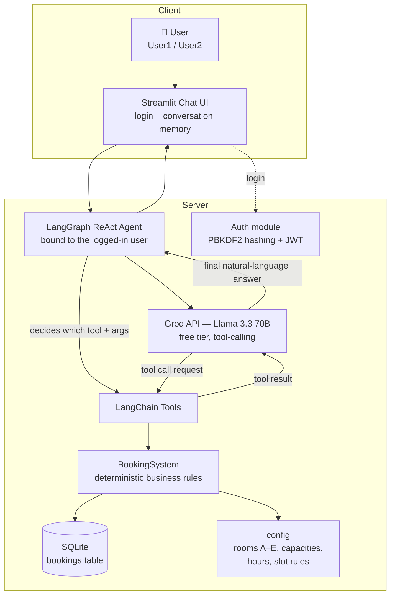

# Room Booking Chatbot — Documentation

## 1. Project overview

The challenge asks for a chatbot with **tool-calling capabilities** to manage meeting-room
bookings in the Cubo Itaú office. The central design decision is a strict separation of
concerns:

- **All business rules live in a deterministic core** (`app/booking_core.py`): slot
  alignment, capacity, duration limits, overlap detection and ownership checks. It has
  23 automated tests (`tests/run_tests.py`) and can be used without any LLM.
- **The LLM never touches the database.** It only sees five tools
  (`create_booking`, `list_available_rooms`, `get_room_schedule`, `cancel_booking`,
  `list_my_bookings`). The model decides *which* tool to call and *with which arguments*;
  the tools validate everything and return human-readable results, including errors.
- **Authentication is enforced outside the model**: the Streamlit UI logs the user in
  (User1/User2 with the challenge password) and the agent is built bound to that user,
  so the tools execute bookings in the user's name. The REST API issues JWT tokens.

This mirrors how agentic systems are built in production: the model is a flexible
language/reasoning layer on top of a deterministic, testable system of record.

## 2. Step-by-step process

1. **Domain core first**: modelled rooms/slots/bookings and encoded every rule from the
   challenge (plus the worked example: a 10:00–11:30 booking blocks any start before
   11:30, and a booking starting exactly at 11:30 is legal).
2. **Test-driven validation**: 23 tests covering creation, overlap edge cases, capacity,
   alignment, max duration, office hours, past slots, cancellation ownership and the
   availability/schedule queries.
3. **Auth + REST API**: salted password hashing (PBKDF2) and JWT; FastAPI endpoints for
   every operation so the system is usable programmatically too.
4. **Tools + agent**: wrapped the core operations as LangChain tools (with docstrings
   the model reads to pick arguments), then built a ReAct agent with LangGraph on top of
   **Groq's free API** (Llama 3.3 70B). The system prompt carries the rules, room
   capacities and *today's date*, and instructs the agent to ask for missing data and
   confirm before booking.
5. **UI**: Streamlit chat with login, conversation memory and a "my bookings" sidebar.
6. **Docs & notebook**: this document, the component diagram and a Jupyter notebook that
   explains and demonstrates each technology.

## 3. Key decisions (and challenge ambiguities)

| Topic | Decision | Why |
|---|---|---|
| Room capacities | A=4, B=6, C=8, D=12, E=20 | The PDF requires room-specific capacities but never states them; values were chosen and documented here. |
| Overlap semantics | End-exclusive (10:00–11:30 frees the room at 11:30) | Exactly matches the example given in the challenge. |
| Office hours | 08:00–20:00 | Not specified in the PDF; needed to bound "past slot" validation. |
| Past bookings | Forbidden | Standard for booking systems; keeps the demo consistent. |
| Cancellations | Only your own bookings | Stated in the challenge ("cancel a booking made by the currently logged-in user"). |
| LLM provider | Groq free tier (Llama 3.3 70B) via LangChain | No credit card required; OpenAI/Ollama/OpenRouter are drop-in alternatives (same LangChain interface). |
| Extra tool `list_my_bookings` | Added beyond the minimum | Needed to give users booking ids for cancellation in a conversation. |

## 4. Component diagram

Flow from the moment the user sends a question until the answer is shown:

The same components are also exposed as a REST API (`app/main.py`), where the endpoints
talk to `BookingSystem` directly and `/chat` runs the agent for programmatic clients.

## 5. Main challenges encountered

- **Ambiguous specification**: the PDF leaves capacities, office hours and past-booking
  behaviour open. Resolved with sensible defaults and documented them explicitly (table above).
- **Overlap correctness**: the trickiest rule. Implemented as a half-open interval test
  (`start < other.end and end > other.start`), verified against the challenge's own example
  and back-to-back bookings.
- **LLM reliability**: tool choice and date/time reasoning are delegated to the model, so
  the system prompt pins the rules, capacities and current date, and every tool validates
  again on execution — the model can be wrong, the system cannot.
- **Free deployment**: Ollama-in-cloud needs 4–12 GB RAM (not viable free); the app ships
  as a single Dockerfile deployable to Hugging Face Spaces or Railway.
